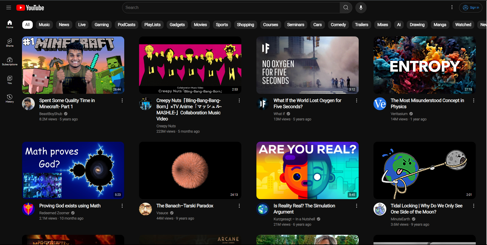

# YouTube Clone

This is a simple YouTube clone that mimics the basic layout and functionalities of YouTube using HTML, CSS, and JavaScript.

## Preview

## Features

- **Content Section**: Dynamically loads and displays videos based on data from 'data.js'.

## Usage

To run the project, simply open the 'index.html' file in your browser. The webpage will load with basic YouTube-like UI components.

